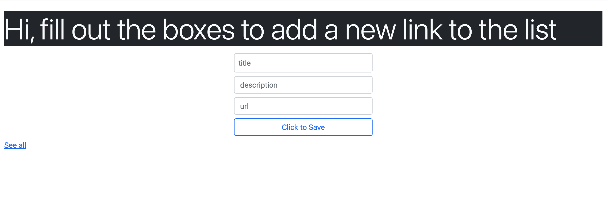
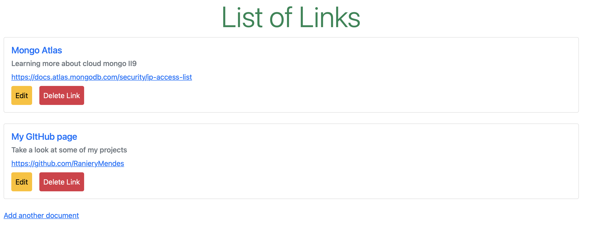

### link_registration

This application works as a registration platform for web links that uses MongoAtlas to host the database. It is deployed at https://my-web-mongo-node.herokuapp.com 

You can add new links, see and edit all the ones registered, as well as delete any one of them. 

## It implments the following technologies:
 
 * HTML
 * Javascript 
 * NodeJS
 * MongoDB 
 * Bootstrap 
 
# Main Page Screen

   

# All Links Screen

